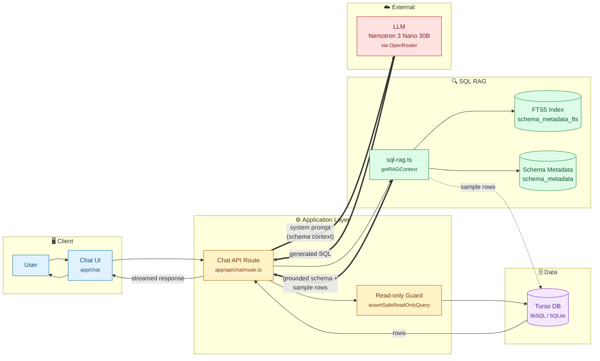

# QueryMind

QueryMind is a natural-language-to-SQL chat application. Ask a question about your data in plain English, and an AI agent retrieves the relevant database schema, generates a SQLite query, executes it, and answers you in business language — no SQL knowledge required.

What sets it apart is a **SQL-focused RAG pipeline**: before the model writes any SQL, a full-text search step retrieves only the schema, columns, and sample rows that are relevant to *your* question. This keeps the LLM grounded in the actual data model instead of guessing at table and column names, which meaningfully improves query accuracy.

---

## Key capabilities

- **Natural-language questions → SQL → answers**, streamed back in real time.
- **SQL RAG retrieval** over schema metadata using SQLite FTS5 (no embeddings, no vector store).
- **Schema-aware grounding** — the model only sees tables/columns relevant to the question, plus a few sample rows from each.
- **Dry Run mode** — generate and inspect the SQL without executing it, ideal for review or demos.
- **Read-only guard** — only `SELECT` statements are allowed; destructive SQL is blocked in both the prompt and a server-side validator.
- **Database Guide panel** — an in-app reference listing all 24 tables and example questions, so testers know what they can ask.
- **Seeded demo database** — 24 tables and ~8,335 rows of realistic faker data across a multi-company e-commerce/SaaS schema.

---

## How it works

1. **You ask a question** (e.g. *"What is the total revenue from completed orders?"*).
2. **SQL RAG** (`lib/sql-rag.ts`) cleans the question into keywords, runs an FTS5 `MATCH` query against `schema_metadata` (trying `AND` of keywords first, falling back to `OR`), and returns the top matching tables.
3. For each matching table it pulls the **description, column types, relationships, and 3 sample rows** — giving the LLM both the shape and the actual values of the data.
4. This context is injected into a **system prompt** that constrains the model to:
   - use only the tables/columns in the provided schema,
   - write SQLite-compatible `SELECT` statements,
   - disambiguate similar tables using documented business rules, and
   - retry on failure (bounded) rather than fabricate results.
5. The model calls a **`db` tool** with the generated SQL. The server runs `assertSafeReadOnlyQuery` (single statement, `SELECT`/`WITH` only, no DDL/DML keywords) before executing against Turso.
6. Results return to the chat UI as a formatted card showing the SQL and row count, followed by the model's plain-English answer.
7. In **Dry Run mode**, the tool is removed entirely and the model returns only the SQL code block for inspection.

---

## Architecture

The arrow from **SQL RAG → Chat API → LLM** is the key edge: retrieved schema and sample rows are injected into the system prompt *before* the model generates SQL, so generation is grounded in the real data model rather than the model's prior assumptions.

---

## Tech stack

| Layer            | Technology                                                              |
| ---------------- | ----------------------------------------------------------------------- |
| Framework        | [Next.js 16](https://nextjs.org) (App Router, Turbopack)                |
| AI SDK           | [`ai`](https://sdk.vercel.ai) + `@ai-sdk/react` (`useChat`)             |
| Model            | `nvidia/nemotron-3-nano-30b-a3b:free` via [`@openrouter/ai-sdk-provider`]|
| Database         | [Turso](https://turso.tech) (libSQL/SQLite)                             |
| ORM / migrations | [Drizzle ORM](https://orm.drizzle.team) + `drizzle-kit`                 |
| SQL RAG           | SQLite FTS5 full-text search on a `schema_metadata` table               |
| UI               | React 19, Tailwind CSS v4, Radix primitives, `react-markdown`           |
| Seed data        | [`@faker-js/faker`](https://fakerjs.dev) (~8,335 rows, 24 tables)       |

---

## Safety notes and limitations

- **Read-only enforcement is defense-in-depth.** The model's system prompt forbids non-`SELECT` statements, and `assertSafeReadOnlyQuery` re-validates on the server (single statement, `SELECT`/`WITH` only, blocks DDL/DML keywords). For production, also run the DB connection as a least-privilege / read-only user at the database layer.
- **Generated SQL should be reviewed before running against production data.** Dry Run mode exists for exactly this.
- **RAG is FTS5-based, not embedding-based.** This keeps the stack lean (no vector store, no embedding model) and works well for schema-keyword matching, but won't catch semantic synonyms the way an embedding store could. The `cleanQuestion` + AND-then-OR fallback handles most phrasing variations.
- **The database in this repo is seeded demo data**, not a real production dataset.